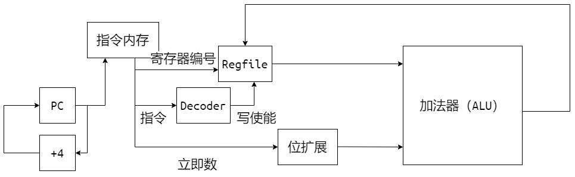
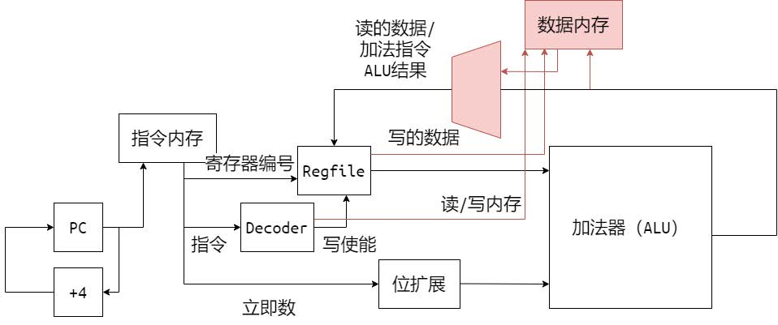
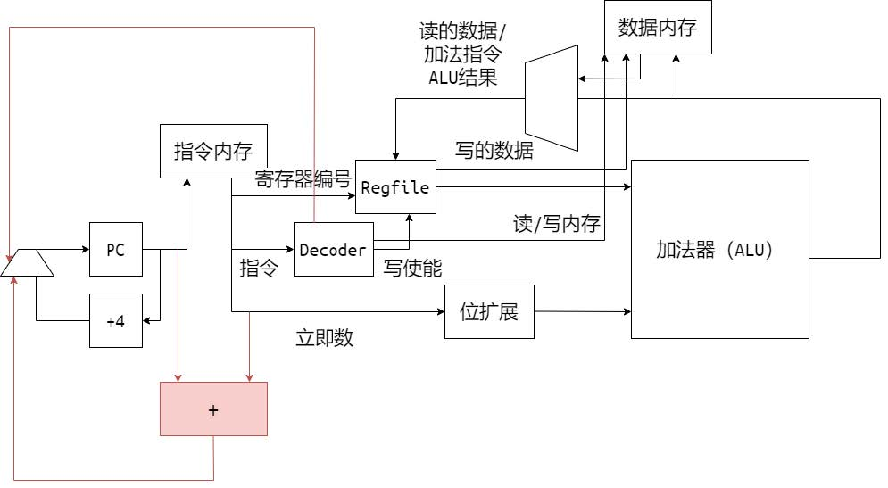

# Lab1 - SingleCycle

本次lab要求实现一个基于MIPS指令集的单周期CPU，需要完成如下指令：

运算指令：add sub and or slt addi；访存指令：lw sw；分支指令：j beq；共10条。

## 单周期CPU

### 1 架构寄存器

架构寄存器包括：

- 32个通用寄存器；
- PC（指令地址）寄存器；
- 其他实现中可能会使用的寄存器（如处理分支延迟槽）；

### 2 如何执行加法

这是一条risc-v的加法指令：

```assembly
2001000A	addi $1, $0, 10
```

CPU 的输入是 `0x2001000A`。

#### 2.1 从指令中获取信息

- 需要执行的操作：`x[rt] = x[rs] + sext(imm)`；
- 指令标识：`instr[31:26] = 001000`；
- 数据标识：`instr[25:21] = rs`，`instr[20:16] = rt`，`instr[15:0] = imm`；

#### 2.2 和已有的电路交互

- 将 PC 传给指令内存，输入指令
- 接入 regfile 的写使能、写入寄存器 rt，读取寄存器 rs

#### 2.3 需要增加的电路

- 识别这条指令
- 对 imm 进行符号位扩展
- 生成 regfile 写使能
- 生成下一条 PC（顺序执行， pc_nxt = pc + 4 ）

#### 2.4 一个简单的电路图



#### 2.5 更多算术指令

除了加法操作不同，其余电路全部相同。将主算术运算集成在 ALU （Arithmetic Logic Unit）中。

需要新增电路：

- 识别指令，生成 ALU 的操作信号
- ALU 集成更多算术运算

### 3 如何访存

这是一条访存指令：

```assembly
8C40000C	lw $1, 12($2)
```

CPU的输入是`0x8C40000C`

#### 3.1 从指令中获取信息

- 需要执行的操作：`x[rt] = M[x[base] + sext(imm)]`；
- 指令标识：`instr[31:26] = 100011`；

#### 3.2 和已有的电路交互

- 寄存器读
- ALU进行地址计算
- 生成下一条 PC（顺序执行， pc_nxt = pc + 4 ）

#### 3.3 需要新增电路

- 添加数据内存端口
- 生成内存读/写使能
- 生成 regfile 写使能

#### 3.4 一个简单的电路图



### 4 如何跳转

这是一条跳转指令：

```assembly
1022003B	beq $1, $2 offset
```

#### 4.1 从指令中获取信息

- 需要执行的操作：`if (x[rs] == x[rt]) pc += sext(offset)`
- 指令表示：`instr[31:26] = 000100`

#### 4.2 与已有的电路交互

- 寄存器读

#### 4.3 需要新增的电路

- rs与rt的比较
- pc与sext(offset)的加法
- pc的选择器与选择信号的生成

#### 4.4 一个简单的电路图



### 5 五级流水结构


## 测试方法

#### vivado仿真

使用vivado打开`vivado/vivado.xpr`，点击`Run Simulation`开始仿真。

若console出现`Test Passed.`字样即为通过，反之（`Test Failed`或无相关字样）为失败。

#### 烧录上板

（建议一定要先通过仿真测试再上板）

synthesis => implementation => generate bitstream

然后上板运行，按下板子上的reset按钮`C12`，右下角LED`K15`亮起即为通过，`H17`亮起为失败。

## 作业提交

DDL：**2024年4月9日 23：59**

提交内容：以学号为命名的`zip`压缩包，如`20302010043.zip`，包括`vsrc`和`report.pdf`。

实验报告需要包括：

- 单周期CPU的简易电路图，建议手绘拍照
- 测试通过的截图/拍照
- 简要说明你的设计思路

实验报告里不应有大段代码的复制。

实验报告里可以有：

- 对本门课程实验（文档、代码风格、视频录制等）的建议
- 对后续内容的期待

