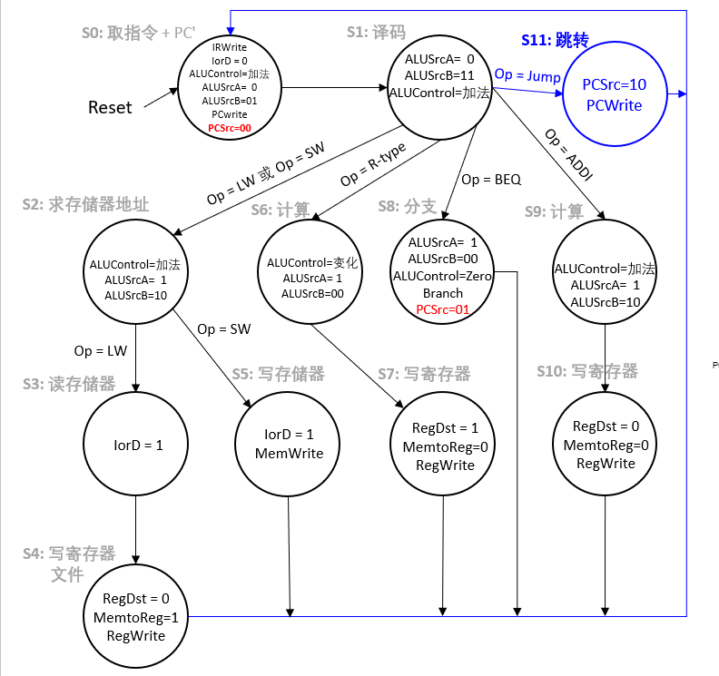
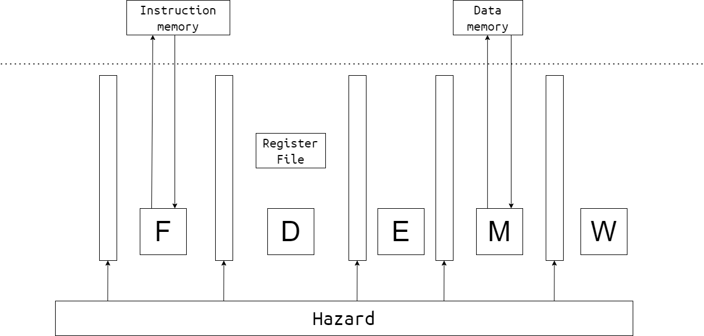

# Lab2 - MultiCycle

本次lab要求实现一个基于MIPS指令集的多周期CPU，需要完成如下指令：

运算指令：add sub and or slt addi；访存指令：lw sw；分支指令：j beq ；共10条。

## 多周期CPU

###  主要难点

- 每个部件之间变成了时序逻辑

- 状态机（FSM）图的理解与涉及

- 数据通路的处理（不多）

### FSM

这是五级流水线的结构，那么我们可以将所有的状态转化为下面的五个阶段

这是上面十条指令需要执行的阶段：

**jump** : f,d
**beq,（bne）** : f,d,e
**R type (add,sub,and,or,slt)和addi** : f,d,e,w
**sw**: f,d,e,m
**lw** : f,d,e,m,w

### 实验加强

该实验可能太简单了？

那根据大家的反馈，我们可以考虑从下面两个角度加强：

- 指令加强。新增一些指令
- 测试数据加强。目前跳转指令后面都是nop，那分支延迟槽执不执行都不影响结果，该设计就没意义了。

## 测试方法

#### vivado仿真

使用vivado打开`vivado/vivado.xpr`，点击`Run Simulation`开始仿真。

若console出现`Test Passed.`字样即为通过，反之（`Test Failed`或无相关字样）为失败。

#### 烧录上板

（建议一定要先通过仿真测试再上板）

synthesis => implementation => generate bitstream

然后上板运行，按下板子上的reset按钮`C12`，右下角LED`K15`亮起即为通过，`H17`亮起为失败。

## 作业提交

DDL：**2024年5月7日 23：59**

提交内容：以学号为命名的`zip`压缩包，如`20302010043.zip`，包括`vsrc`和`report.pdf`。

实验报告需要包括：

- 多周期CPU的简易电路图，建议手绘拍照
- 测试通过的截图/拍照
- 简要说明你的设计思路

实验报告里不应有大段代码的复制。

实验报告里可以有：

- 对本门课程实验（文档、代码风格、视频录制等）的建议
- 对后续内容的期待

