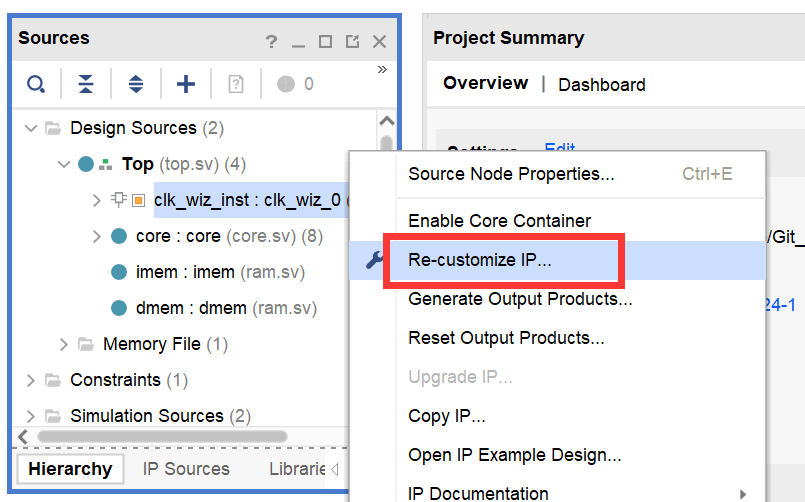
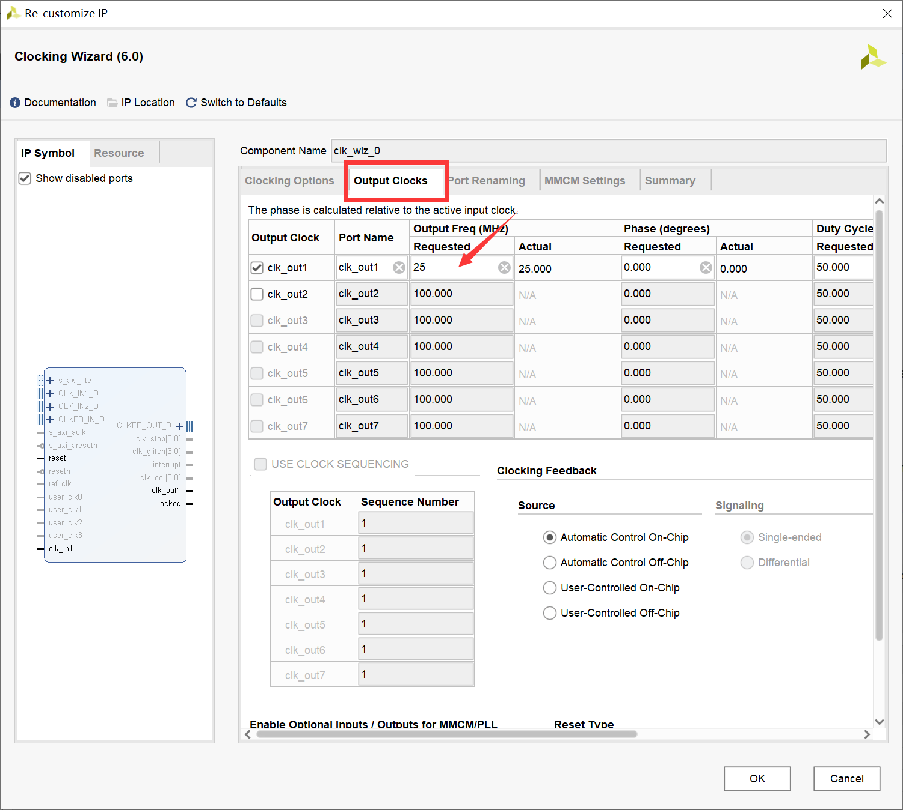

# Lab3 - Pipeline

本次lab要求实现一个基于MIPS指令集的五级流水线CPU，需要完成的指令与Lab1相同。

开发前，请执行以下指令更新仓库，同时合并你先前单周期的实现：

```shell
$ git fetch --all
$ git switch lab3
$ git checkout -b lab3-dev
$ git merge lab1-dev
```

## 五级流水结构

在现代处理器架构中，流水线技术是提高指令处理速率的关键方法之一。通过流水线技术，可以将指令的执行过程划分为几个阶段，每个阶段完成特定的任务。在五级流水线中，这些阶段通常包括取指（Fetch）、译码（Decode）、执行（Execute）、访存（Memory）和写回（Write Back）。


#### 流水线寄存器

流水线寄存器在这些阶段之间起到关键的**传递**和**同步**作用，用来控制时序，是流水线设计中不可或缺的组成部分。流水线寄存器的主要作用是在处理器的各个执行阶段之间传递数据和控制信号。它们确保每个流水线阶段可以在下一个时钟周期接收到上一阶段处理的结果，从而使得多条指令能够并行地在不同的处理阶段同时进行。这种设计显著提高了处理器的指令吞吐率和整体效率。

**Fetch-Decode**

在取指和译码阶段之间的寄存器。它存储从指令存储器取出的指令，以便译码阶段可以解析指令，确定所需的操作和操作数。此寄存器通常包含：

- 指令代码（Instruction code）
- 下一条指令的地址（Program Counter, PC）

**Decode-Execute**

在译码和执行阶段之间的寄存器。它传递解码后的指令信息和操作数到执行单元。此寄存器内容包括：

- 操作码（Opcode）
- 源操作数值（Source operands）
- 目的寄存器地址（Destination register address）
- 必要的控制信号（如ALU操作类型，是否进行内存访问等）

**Execute-Memory**

在执行和访存阶段之间的寄存器。它传递执行结果和下一步所需的访存或进一步处理的信息。该寄存器通常包括：

- 执行结果（如ALU结果）
- 要写入的目的寄存器地址
- 存储器访问操作的信息（如存储器地址和访问类型）

**Memory-WriteBack**

在访存和写回阶段之间的寄存器。它传递从存储器读取的数据或执行阶段的结果到写回阶段，以便完成指令的执行。包括：

- 存储器读取数据或之前阶段的计算结果
- 写回的目的寄存器地址

流水线寄存器是实现高效五级流水线的核心组件，通过在处理器的关键阶段提供数据和控制信号的缓存和同步，极大地提升了指令处理的速度和效率。合理设计这些寄存器对于优化处理器性能至关重要。

> 注：上述每两个阶段之间的寄存器信号均为理论上的设计，实际开发中需要根据各自细节设计的不同进行调整以适配你的流水线。

设计流水线寄存器时，重要的考虑因素：

- **时序控制**：确保数据在流水线各阶段同步正确传递，以避免数据冒险和控制冒险
- **冒险处理**：通过流水线寄存器提供的数据，设计适当的冒险检测和处理机制，如使用前向传递（forwarding）和暂停（stalling）

#### 流水线冒险

流水线设计中有三大冒险：

结构冒险（硬件条件不支持），控制冒险（主要体现在跳转指令不能正确取指）与数据冒险（指令间的数据依赖关系）；

本次lab只需考虑后两者：控制冒险与数据冒险。

##### 1、控制冒险

一个控制冒险示例：

```assembly
.data  
    array: .word 0, 1, 2, 3, 4  
    target: .word 0x1000  
  
.text  
.globl main  
main:  
    # 假设我们要检查array[2]是否等于2  
    la $t0, array   # $t0 = &array[0]  
    addi $t0, $t0, 8  # $t0 = &array[2] (因为每个word是4字节)  
    lw $t1, 0($t0)  # $t1 = array[2]  
  
    # 接下来是一个条件分支，它可能导致控制冒险  
    beq $t1, 2, target_label  # 如果$t1等于2，跳转到target_label  
  
    # 一些非分支指令，这些指令在分支预测为不跳转时会继续执行  
    # 但如果分支预测错误，这些指令将被丢弃  
    add $t2, $t1, $zero  # 假设的操作  
    sw $t2, 0($t0)       # 将结果存回array[2]（实际上这没有意义，只是示例）  
  
    # 分支后的指令，这些指令在分支跳转时会执行  
    # 但如果分支不跳转，这些指令将不会被执行  
target_label:  
    j end  # 跳转到程序结束  
  
end:  
    # 程序结束代码（例如，系统调用以退出程序）  
    # ...
```

##### 2、数据冒险

数据冒险由数据相关导致，数据相关有三大类：写后读（RAW），读后写（WAR），写后写（WAW）

写后读，某一地址上的数据要先完成写操作，然后才能读，即下一条指令依赖于上一条指令的执行结果，必须先将结果写入之后再由下一条指令来读。如果先读的话读到的是旧值，不是运算的正确输入。例如：

```assembly
addi $t1, $t1, 1
addi $t0, $t1, 1
```

读后写，某一地址上的数据要先完成读操作（需要用到读的数据），然后才能写（否则导致数据丢失），即指令在读取某一数据之前其读取的对象先被相关的指令写入了运算结果，这导致了读取的数据不是原来的数据，而是下一条指令运行的结果。例如：

```assembly
sw $t0, x
addi $t0, $t0, 1
```

写后写，对同一个器件写入数据的时候，要保证先写后写，即最后将要输出的值为后一条指令的执行结果，可是这条指令却先执行并写入了，之后执行了上一条指令的写入操作，对应于输出的结果而言就出现冲突了。例如：

```assembly
addi $t0, $t2, 1
addi $t0, $t3, 1
```

此次lab只需要考虑**写后读**导致的数据冒险情况，问题在于从regfile中读取数据时，前面的指令还未更新无法取到正确的数据。

> Hint：访存也会导致写后读

#### 阻塞与气泡

五级流水线中，为了处理冒险情况，会有阻塞与气泡。

- 阻塞是指流水线寄存器保持旧值，不向前流动；
- 气泡是指流水线寄存器被填充为nope；

> 注：一切冒险都可以用阻塞的方式解决，但希望大家非必要不要这么搞。

##### Hazard

为了处理流水线冒险，一般由Hazard模块产生各个流水线寄存器的控制信号：stall与flush；从而控制流水线在当前周期如何流动。例如：

```verilog
typedef struct packed {
    logic flush;
    logic stall;
} hazard_data_item_t;

typedef struct packed {
    hazard_data_item_t fetch;
    hazard_data_item_t decode;
    hazard_data_item_t execute;
    hazard_data_item_t memory;
    hazard_data_item_t writeback;
} hazard_data_t;
```

#### 数据转发

针对写后读数据冒险，一般考虑使用转发的方式，在不显著增加时钟周期的前提下处理。

转发的逻辑是：当前流水线中存在一些指令，已经计算出结果但还未写回到regfiles（例如memory阶段的指令）；这部分指令还未写回可能会导致它后续的指令无法正确读到更新过的数据。因此需要为这部分数据建立一个旁路，使其可以提前被使用。

## 测试方法

#### vivado仿真

使用vivado打开`vivado/vivado.xpr`，点击`Run Simulation`开始仿真。

若console出现`Test Passed.`字样即为通过，反之（`Test Failed`或无相关字样）为失败。

#### 烧录上板

（建议一定要先通过五种仿真测试再上板，尤其是时序仿真）

synthesis => implementation => generate bitstream

然后上板运行，按下板子上的reset按钮`C12`，右下角LED`K15`亮起即为通过，`H17`亮起为失败。

#### 时钟约束

在lab1中，部分同学的cpu上板失败的原因是数据通路较长，而时种周期较短，导致一个时钟周期内无法正确地更新cpu的状态。

考虑到这一问题，我们更新了top模块的时钟频率，为大家提供了一个稳定的25MHz时钟信号使用（旧时钟信号为100MHz）：

```verilog
// vsrc/top.sv, line 15
/* clock */
logic clk_25MHz;
clk_wiz_0 clk_wiz_inst (
    .clk_in1(clk),
    .clk_out1(clk_25MHz),
    .reset(reset)
);
```

如若发现25MHz还是太大，需要降低时钟频率的话，可在vivado中修改：

1. `clk_wiz_inst` => `Re-customize IP`：



2. `Output Clocks` => `Requested`设置为你想要的时钟频率：



> 注：如若你有修改时钟频率，请在实验报告中指明修改后的时钟频率。另外，降低时钟频率意味着延长cpu的处理时间，在实际开发中是不推荐的。但本次实验不会计算性能分，因此如有需要可以修改。

## 参考资料

实现过程中如有疑问，可以参考[ICS-2021Spring-FDU](https://fducslg.github.io/ICS-2021Spring-FDU/arch-lab/lab1.html#12-%E4%BA%94%E7%BA%A7%E6%B5%81%E6%B0%B4%E7%BA%BF)（无需关注“封装cpu”等与我们实验不适配的内容）

## 作业提交

DDL：**2024年6月11日 23：59**

提交内容：以学号为命名的`zip`压缩包，如`20302010043.zip`，包括`vsrc`和`report.pdf`。

实验报告需要包括：

- 流水线CPU的简易电路图，建议手绘拍照
- 测试通过的截图/拍照
- 简要说明你的设计思路

实验报告里不应有大段代码的复制。

实验报告里可以有：

- 对本门课程实验（文档、代码风格、视频录制等）的建议
- 对后续内容的期待

